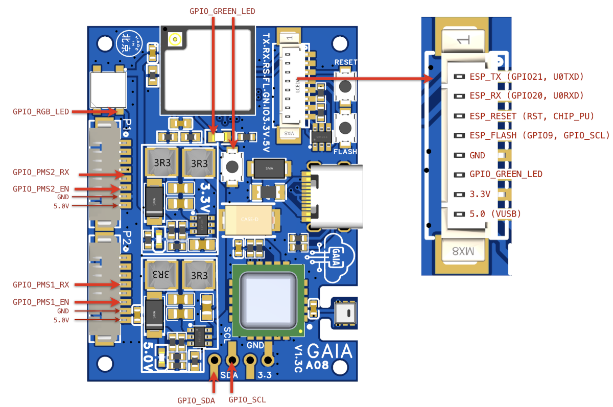

# GAIA A08 Firmware

This repository is the open-source Arduino firmware used for the
[GAIA A08](https://aqicn.org/gaia/a08/).

[](https://github.com/aqicn/gaia-a08-arduino/actions/workflows/compile-platformio.yml)

## Configuration

To start with, you need to update the `config.h` file with your your aqicn.org
Data-Platform token and the station location:

```C
#define TOKEN "dummy-token-for-test-purpose-only"

#define LATITUDE 48.756080
#define LONGITUDE 2.302038
```

You can get your own token from https://aqicn.org/data-platform/token/

By default, the device will use the
[Wi-Fi Manager](https://github.com/tzapu/WiFiManager) to connect to your Wi-Fi
access point. If you want to configure a static Wi-Fi access point instead,
comment out `CONF_USE_WIFI_MANAGER` and define `WIFI_SSID` and `WIFI_PASS` in
the `config.h` file.

```C
//#define CONF_USE_WIFI_MANAGER
#define WIFI_SSID "yourNetworkName" 
#define WIFI_PASS "yourNetworkPassword"
```

## Libraries

The firmware uses the following libraries:

| Used library                     | Version | Comment                   |
| -------------------------------- | ------- | ------------------------- |
| fu-hsi/PMS Library               | ^1.1.0  | PMS5003 driver            |
| sensirion/Sensirion I2C SCD4x    | ^0.4.0  | CO2 sensor driver         |
| jandelgado/JLed                  | ^4.13.1 | RGB Led effects           |
| bblanchon/ArduinoJson            | ^7.1.0  |                           |
| dvarrel/AHT20                    | ^1.0.0  | Temperature sensor driver |
| kitesurfer1404/WS2812FX          | ^1.4.4  | RGB Led driver            |
| ESP32Async/ESPAsyncWebServer     | ^3.7.0  |                           |
| github.com/tzapu/WiFiManager.git | 2.0.17  |                           |

## Compilation

### Platform IO

If you use platform IO, you can just use `make compile-platformio` to compile,
upload, and start the monitor. Note that, by default, the `CONF_USE_WEB_SERVER`
configuration flag is enabled by default for Platform IO.

### Arduino CLI/IDE

This branch does not support Arduino IDE and Arduinno CLI. If you need to
compilation using the Arduino tools, use the `arduino` branch:
https://github.com/aqicn/gaia-a08-arduino/tree/arduino

## Running

Once the sensor is running with the firmware, you can check your station Data
from https://aqicn.org/data-feed/verification/.

To see you station, you first need to enter the token you previously got from
the aqicn.org data-platform.

## Gaia A08 - HW GPIO mapping



```C
#define GPIO_RGB_LED 1
#define GPIO_GREEN_LED 10
#define GPIO_5V_PWR_EN 2
#define GPIO_SDA 8
#define GPIO_SCL 9
#define GPIO_PMS1_RX 4
#define GPIO_PMS2_RX 7
```

## Todo

- [x] Add support for green LED breathing
- [x] Add support for CO2 sensor
- [x] Add support for uploading CO2 sensor temperature and humidity
- [x] Add support for embedded HTTP server
- [x] Add support for Wifi Manager
- [x] Add support for platform IO
- [ ] Add support for Dual PMS configuration
